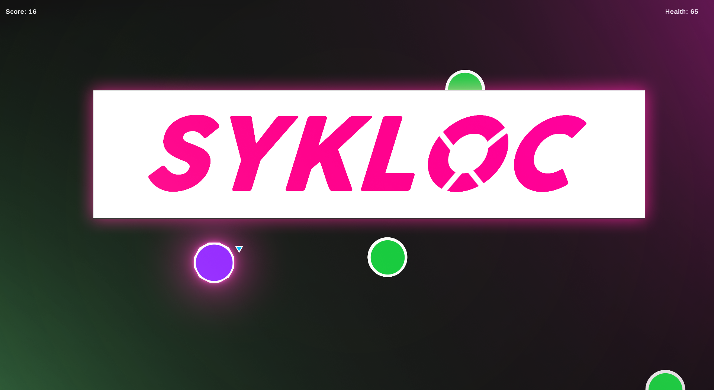

# Sykloc - Unity Game

## Game Description

Welcome to Sykloc, a simple and addictive Unity game where your goal is to survive as long as possible by shooting down waves of enemies with your trusty circle-shaped player character.

In this game, you control a circular player character that can shoot bullets continuously. Enemies will randomly spawn on the screen at regular intervals, and your task is to move and eliminate them with your bullets. You start with 100 health points, and if your health reaches zero, the game ends. Your objective is to achieve the highest score by defeating as many enemies as you can before your health runs out.

Sykloc is designed for quick and exciting gameplay sessions, making it perfect for players of all ages.

## How to Play

1. **Starting the Game**: Launch the game, and you will be presented with the main menu. Click on the "Start Game" button to begin.

2. **Gameplay**: Once in the game, your circular player character will be placed at the center of the screen. Enemies will start spawning randomly around the screen's edges.

3. **Aim and Shoot**: Use your mouse or touch input to aim the player character. The character will automatically shoot bullets in the direction of your cursor.

4. **Defend Yourself**: As enemies appear, move your player character towards them and shoot to eliminate them. Each enemy you destroy will earn you points.

5. **Health**: You start the game with 100 health points. Be cautious not to let your health drop to zero. If your health runs out, the game will end.

6. **Game Over**: When the game ends, you will see your final score. You can choose to play again by clicking the "Play Again" button on the game over screen.

## Controls

- **Mouse/Touch Input**: Move the cursor to aim your player character.
- **Left Mouse Button/Touch**: Shoot bullets continuously.

## Scoring

- Each enemy you defeat earns you points.
- The score is displayed at the top of the screen during gameplay.
- Try to achieve the highest score possible by eliminating as many enemies as you can before your health runs out.

## Installation

1. **Download**: Download the game from the provided download link or source repository.

2. **Unzip (if necessary)**: If the game is in a compressed format (e.g., ZIP), unzip the files to a location of your choice.

3. **Launch**: Double-click the game executable (e.g., "Sykloc.exe") to start playing.

4. **Enjoy**: Have fun playing Sykloc and aim for the highest score!

## Credits

- Game developed by Sjuhyeon
- Music and sound effects sourced from [Joshua McLean](https://www.youtube.com/watch?v=L_OYo2RS8iU&list=PLwJjxqYuirCLkq42mGw4XKGQlpZSfxsYd&index=8)
- Special thanks to Unity3D for the game engine

Thank you for playing Sykloc! I hope you enjoy the game and have a blast shooting down those enemies! If you encounter any issues or have feedback, please feel free to reach out to us at [My Discord](https://discord.com/users/1070079034366631956). Have fun and happy shooting!
